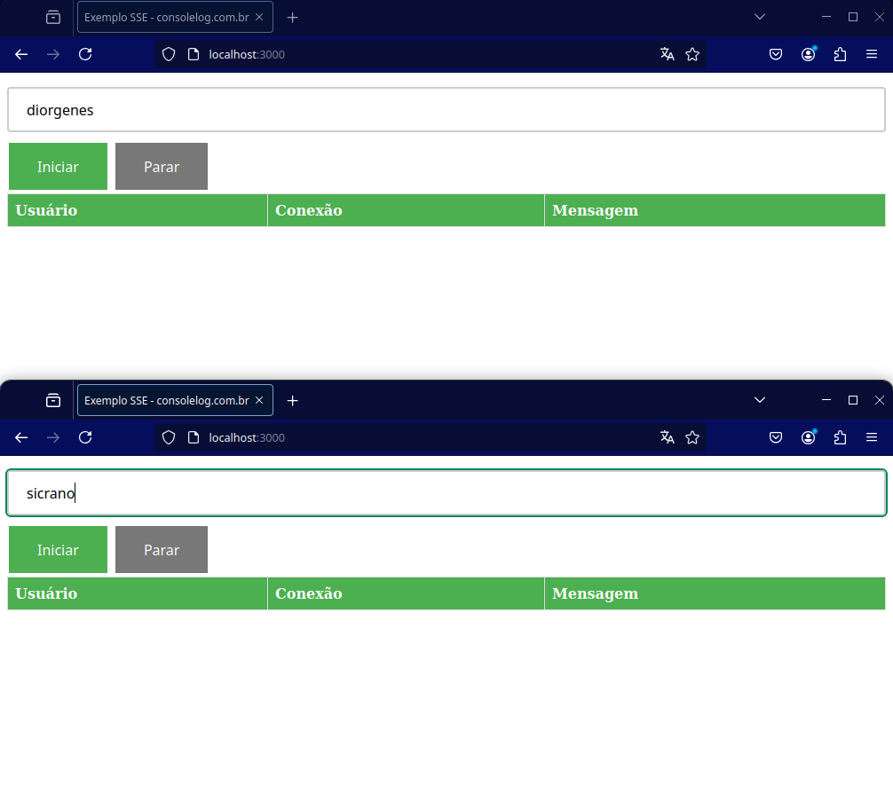
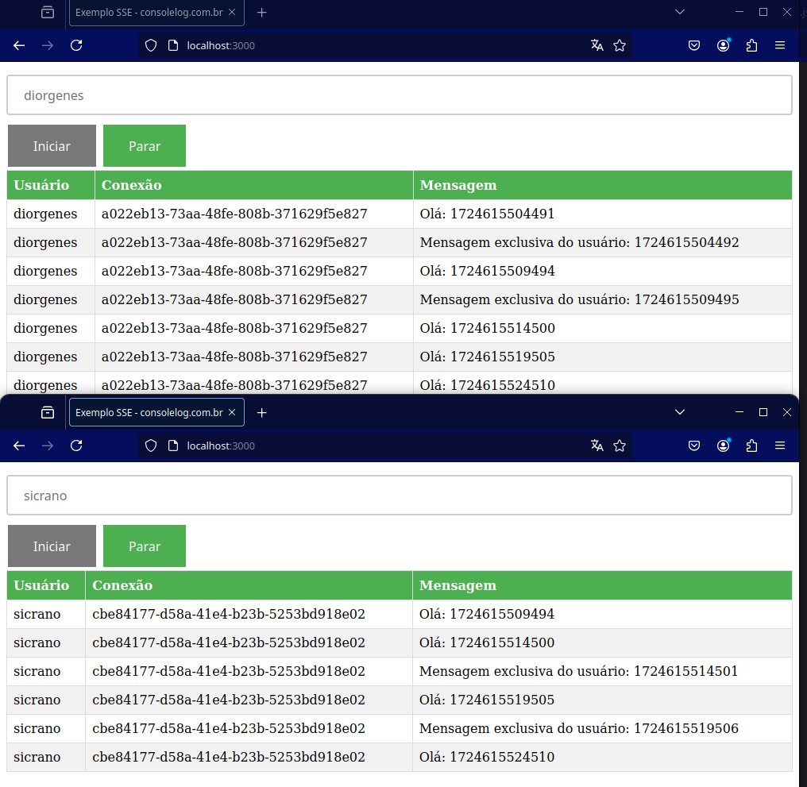

# SSE - Server Sent Events

>
> O Server-Sent Events (SSE) é uma tecnologia que permite que servidores enviem dados em tempo real para clientes web de forma eficiente.
> Essa comunicação unidirecional ocorre através de uma única conexão HTTP persistente.
>

Este POC é baseada no artigo de Marcelo Ribas Vismari no [console.log](https://consolelog.com.br/enviando-mensagens-em-tempo-real-para-seu-frontend-com-sse-server-sent-events/?ref=console-log-newsletter)

- Instalar as dependências

```sh
yarn
```

- Executar

```sh
yarn start
```

Após executar o servidor, abra duas abas no navegar:



O resultado:


